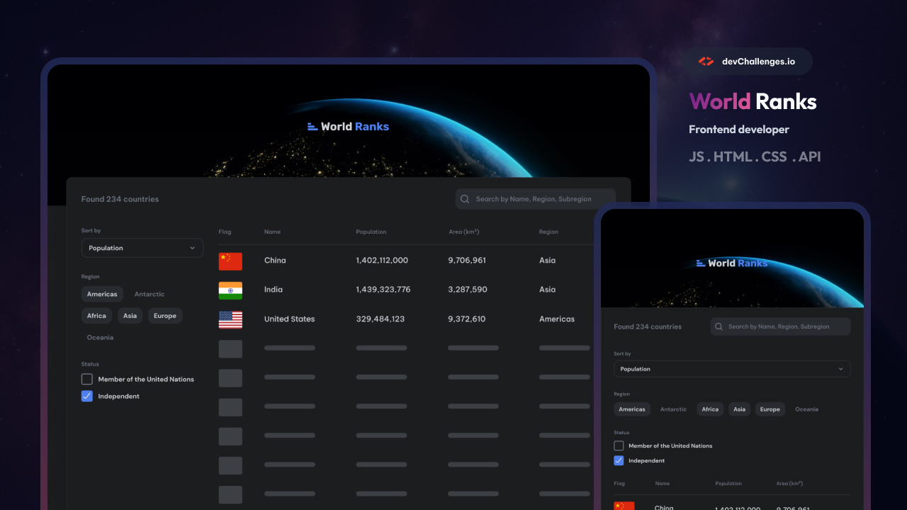

# 🌍 Country Ranking App



## 🎯 Live Demo

🔗 [View Live Demo](https://country-page-eight.vercel.app/)  
📦 [GitHub Repository](https://github.com/Vladimir-Sag/Country-Page)

---

## 📝 Project Overview

A comprehensive country ranking and information web application that allows users to explore countries worldwide with powerful filtering and sorting capabilities. Built with Next.js, TypeScript, and Tailwind CSS, the app fetches real-time data from the RestCountries API and provides an intuitive interface for browsing countries by region, status, and various sorting criteria. Users can view detailed information about each country, including neighboring countries with clickable navigation.

**This project was completed as part of a frontend development challenge.**

---

## ✨ Features

### Core Functionality

- ✅ Display list of countries with flags, population, area, and region
- ✅ Sort countries by population, name (alphabetical), or area
- ✅ Filter countries by multiple regions (Americas, Africa, Asia, Europe, Oceania, Antarctic)
- ✅ Filter countries by status (UN members, independent countries)
- ✅ Search countries by name, region, or subregion
- ✅ Real-time filtering with debounced search (500ms delay)
- ✅ Total countries counter updates dynamically with filters

### Country Details Page

- ✅ Detailed view with official name, capital, subregion, languages, currencies, continents
- ✅ Population and area information with formatted numbers
- ✅ Neighbouring countries display with flags and links
- ✅ Responsive flag images with Next.js Image optimization
- ✅ Clickable neighbour countries navigation

### UI/UX

- ✅ Skeleton loading states for better perceived performance
- ✅ Responsive design (mobile → tablet → desktop)
- ✅ Dark theme optimized with CSS variables
- ✅ Fixed-width monospace layout for consistent card display
- ✅ Hover states and transitions for interactive elements

### Technical Features

- ✅ Server-side rendering with Next.js App Router
- ✅ TypeScript for type safety
- ✅ Tailwind CSS for utility-first styling
- ✅ AbortController for request cancellation
- ✅ Debounced search input to reduce re-renders
- ✅ Memoized filtered results with useMemo
- ✅ Optimized images with Next.js Image component
- ✅ Custom font integration (Be Vietnam Pro)

---

## 🛠 Technologies Used

| Category             | Technologies                                       |
| -------------------- | -------------------------------------------------- |
| **Framework**        | Next.js 15 (App Router)                            |
| **Language**         | TypeScript                                         |
| **Styling**          | Tailwind CSS, CSS Variables                        |
| **State Management** | React Hooks (useState, useEffect, useMemo, useRef) |
| **Data Fetching**    | Fetch API with AbortController                     |
| **Deployment**       | Vercel                                             |
| **Package Manager**  | pnpm / npm                                         |

---

## 📡 API Reference

Country data is fetched from **RestCountries API v3.1**:

```http
# Get all countries with selected fields
GET https://restcountries.com/v3.1/all?fields=name,population,flags,area,region,subregion,independent,unMember

# Get specific country by alpha code
GET https://restcountries.com/v3.1/alpha/{countryCode}

# Get multiple countries by codes
GET https://restcountries.com/v3.1/alpha?codes={code1},{code2}
```
